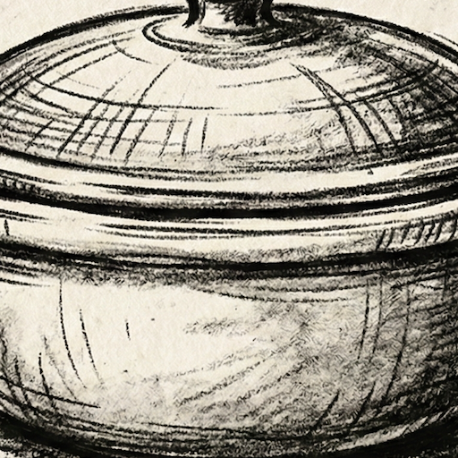
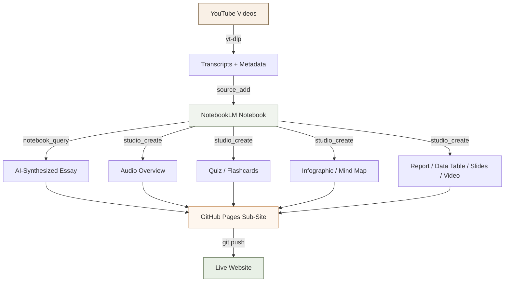
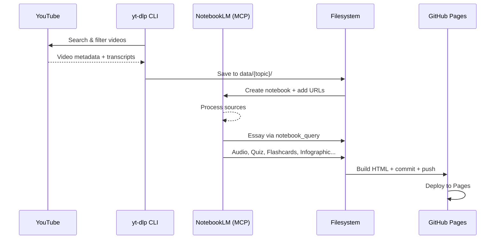

# 🍲 Covered Dish

> Deep research distilled into immersive, interactive explorations. YouTube videos analyzed by AI, synthesized into essays, quizzes, podcasts, and more.

**Live site**: [covered-dish.github.io](https://covered-dish.github.io)



## What is Covered Dish?

Covered Dish is an AI-powered research hub that transforms YouTube video content into comprehensive, interactive learning experiences. Each topic is built from curated video sources, analyzed through Google NotebookLM, and presented as a richly designed sub-site with:

- 📝 **AI-synthesized essays** — grounded in source material, broken up with hand-drawn charcoal illustrations
- 🎧 **Audio overviews** — podcast-style discussions generated by NotebookLM
- 📊 **Infographics** — visual summaries of key concepts
- 🧠 **Interactive quizzes** — test your knowledge with instant feedback and scoring
- 🃏 **Flashcards** — flip-to-reveal study cards
- 🗺️ **Mind maps, data tables, reports** — multiple formats for different learning styles

## Architecture



## Pipeline Flow



## Topics

| Topic | Status | Sources | Description |
|-------|--------|---------|-------------|
| **Acoustic Folk Production in Bitwig** | ✅ Live | 16 videos | MIDI-based folk/country/indie production, mixing, mastering |
| **From Open Chords to Flourishes** | ✅ Live | 16 videos | Chicken picking, chord embellishments, pentatonic licks, bass runs |
| **Vibe Coding Literary Fiction** | 🔜 Coming Soon | — | AI-assisted fiction writing workflows with Claude + Antigravity |
| **Literary Fiction Reviews** | 🔜 Coming Soon | 20 books | Bolaño, Cormac McCarthy, Knausgaard, Carson, Chiang, and more |

## Tech Stack

This project was built entirely by an AI agent:

- **AI Agent**: Claude Opus 4.6 in Google Antigravity (Agent Manager)
- **YouTube Scraping**: `yt-dlp` CLI for transcript and metadata extraction
- **AI Research**: NotebookLM MCP Server for notebook creation, source ingestion, essay generation, and artifact creation
- **Image Generation**: Gemini Nano Banana (Google AI Ultra subscription)
- **Image Processing**: ImageMagick for charcoal illustration vignetting
- **Browser Integration**: Antigravity browser subagent for visual verification
- **Hosting**: GitHub Pages (static, from `/docs` directory)
- **Code Review**: Google Code Assist GitHub App
- **Version Control**: git with feature branches, worktrees, GitHub Issues + PRs
- **CI/CD**: GitHub Actions for Pages deployment

## Project Structure

```
covered-dish.github.io/
├── docs/                          # GitHub Pages root
│   ├── index.html                 # Home page (hero, search, topic cards)
│   ├── css/style.css              # Design system
│   ├── js/app.js                  # Search, quiz, flashcard logic
│   ├── images/                    # Logo + charcoal illustrations
│   └── topics/
│       ├── bitwig-acoustic/       # Sub-site: Bitwig folk production
│       │   ├── index.html
│       │   └── assets/            # Audio, infographic
│       └── guitar-technique/      # Sub-site: Guitar technique
│           ├── index.html
│           └── assets/
├── data/                          # Raw research data
│   ├── bitwig-acoustic/
│   │   ├── yt_links.txt
│   │   ├── metadata.json
│   │   ├── essay.md
│   │   ├── transcripts/           # VTT files
│   │   └── artifacts/             # NLM artifacts (audio, quiz, etc.)
│   └── guitar-technique/
│       ├── yt_links.txt
│       ├── metadata.json
│       ├── essay.md
│       ├── transcripts/
│       └── artifacts/
├── GEMINI.md                      # AI agent instructions
├── README.md                      # This file
└── .agent/                        # Agent workflows
```

## For Hackers

### Adding a New Topic

1. **Curate YouTube videos** — search with `yt-dlp "ytsearch20:your query"` 
2. **Download transcripts** — `yt-dlp --write-auto-sub --sub-lang en --skip-download`
3. **Create NLM notebook** — `nlm notebook create "Topic Title"` or via MCP
4. **Add sources** — `nlm source add <nb-id> --url "https://youtube.com/..."`
5. **Generate essay** — `nlm notebook query <nb-id> "Write an essay about..."`
6. **Generate artifacts** — create all 9 types (audio, video, report, mind_map, slide_deck, infographic, data_table, quiz, flashcards)
7. **Download artifacts** — `nlm download <type> <nb-id> --output path`
8. **Build sub-site page** — copy the template from an existing topic
9. **Update home page** — add a topic card to `docs/index.html`
10. **Commit and push** — GitHub Pages auto-deploys

### Design System

- **Fonts**: Playfair Display (headings) + Inter (body)
- **Colors**: White background, warm grays, copper accents (`#b87333`)
- **Illustrations**: Hand-drawn charcoal style, vignetted to white with ImageMagick
- **Interactive elements**: Quiz with scoring, flashcards with flip animation

## Meta

This entire project — research, content generation, site design, code, images, and documentation — was built autonomously by **Claude Opus 4.6** running in **Google Antigravity** (Agent Manager). The agent used:

- `yt-dlp` skill for YouTube transcript extraction  
- NotebookLM MCP server for AI research synthesis  
- Gemini Nano Banana image generation (Google AI Ultra)
- `magick` CLI for image post-processing  
- `gh` CLI for GitHub operations  
- Browser integration for visual verification

## License

Creative Commons Attribution 4.0 — see [LICENSE](LICENSE).